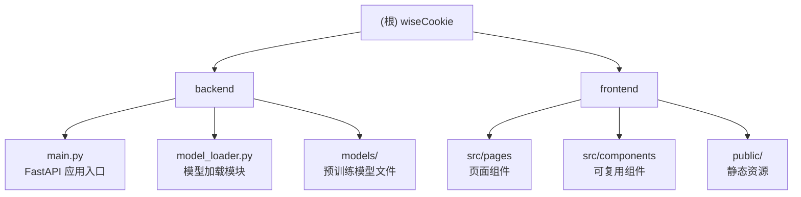

# wiseCookie - 智能 Cookie 管理工具

> 最后更新时间：2025-11-11T15:30:03+0800

## 变更记录 (Changelog)

### 2025-11-11
- **首次生成** - 完成项目初始架构文档扫描和生成

---

## 项目愿景

wiseCookie 是一个基于机器学习的饼干（Cookie）性质预测与数据分析平台。该项目旨在通过智能算法预测饼干的质量特征，并提供交互式的数据查看和相似度搜索功能，帮助食品研发人员优化配方和生产工艺。

**核心价值：**
- 提供准确的饼干质量预测，基于面筋含量、蛋白质含量和硬度等关键特征
- 支持相似度搜索，快速找到符合目标特性的配方
- 可视化展示饼干性质数据，支持多维度筛选和分析

---

## 架构总览

本项目采用前后端分离架构：

- **后端 (Backend)**: Python + FastAPI，提供 RESTful API 服务
  - 机器学习模型推理服务（使用 scikit-learn）
  - 特征工程和数据预处理
  - CORS 跨域支持

- **前端 (Frontend)**: React + Vite，提供交互式 Web 界面
  - 模型预测表单
  - CSV 数据交互式表格
  - 相似度搜索和类型筛选
  - 响应式设计

**技术栈：**
- 后端：FastAPI, uvicorn, pandas, scikit-learn, joblib, numpy
- 前端：React 19, Vite 7, TanStack Table, Axios, PapaParse, React Router DOM
- 数据格式：CSV, JSON, Joblib (模型持久化)

---

## 模块结构图



---

## 模块索引

| 模块路径 | 语言 | 职责 | 入口文件 | 文档 |
|---------|------|------|----------|------|
| `backend/` | Python | 机器学习模型推理 API 服务 | `main.py` | [backend/CLAUDE.md](./backend/CLAUDE.md) |
| `frontend/` | JavaScript (React) | 用户界面和数据可视化 | `src/main.jsx` | [frontend/CLAUDE.md](./frontend/CLAUDE.md) |

---

## 运行与开发

### 环境要求

- **后端**: Python 3.13+ (推荐使用虚拟环境)
- **前端**: Node.js 16+ 和 npm

### 快速启动

#### 后端服务

```bash
cd backend
python -m venv venv
source venv/bin/activate  # Windows: venv\Scripts\activate
pip install -r requirements.txt
python main.py
```

后端将在 `http://127.0.0.1:23300` 启动。

**API 端点：**
- `GET /` - 健康检查
- `GET /api/v1/features` - 获取模型期望的输入特征列表
- `POST /api/v1/predict` - 提交特征数据进行预测

#### 前端服务

```bash
cd frontend
npm install
npm run dev
```

前端将在 `http://localhost:5173` 启动（默认）。

**可用脚本：**
- `npm run dev` - 启动开发服务器
- `npm run build` - 构建生产版本
- `npm run lint` - 运行 ESLint 检查
- `npm run preview` - 预览生产构建

### 配置说明

- **后端 API 地址**: 前端配置在 `frontend/src/components/PredictionForm.jsx` 的 `API_URL` 常量中
- **CORS 配置**: 后端 `main.py` 中的 `origins` 列表，需要添加允许访问的前端域名
- **模型文件**: 存放在 `backend/models/` 目录，包括 `ensemble_model.joblib` 和 `data_processor.joblib`

---

## 测试策略

### 后端测试
- **单元测试**: 暂无自动化测试（建议添加 pytest）
- **手动测试**: 通过 API 端点测试模型预测功能
- **模型验证**: 确保模型文件存在且可正常加载

### 前端测试
- **代码质量**: ESLint 配置确保代码规范
- **手动测试**: 通过浏览器测试各页面功能
- **跨浏览器测试**: 建议测试主流浏览器兼容性

### 集成测试
- 测试前后端 API 通信
- 验证 CORS 配置正确性
- 测试完整的用户流程（输入 → 预测 → 展示结果）

---

## 编码规范

### Python (后端)
- **风格**: PEP 8
- **文档字符串**: 使用详细的函数和类注释
- **类型提示**: 使用 Pydantic 模型进行数据验证
- **命名**: 使用蛇形命名法 (snake_case)

### JavaScript (前端)
- **风格**: ESLint 配置 (基于 @eslint/js 推荐规则)
- **组件**: 使用函数组件和 React Hooks
- **命名**: 组件使用 PascalCase，变量和函数使用 camelCase
- **文件结构**: 按功能组织（pages, components）

### 通用规范
- **提交消息**: 使用清晰的中文描述
- **代码审查**: 关注安全性和性能
- **依赖管理**: 及时更新依赖包，修复安全漏洞

---

## AI 使用指引

### 在此项目中如何与 AI 协作

1. **代码理解与重构**
   - 向 AI 描述你需要理解的模块或函数
   - 请求代码优化建议，特别是特征工程和预处理流程

2. **新功能开发**
   - 前端：添加新的页面或组件（如数据上传、批量预测）
   - 后端：扩展 API 端点，添加新的模型支持

3. **问题诊断**
   - 提供错误日志和相关代码片段
   - 描述预期行为与实际行为的差异

4. **文档维护**
   - 当添加新模块或功能时，更新对应的 CLAUDE.md
   - 保持变更记录 (Changelog) 的时效性

### 关键文件路径
- 后端入口：`backend/main.py`
- 前端入口：`frontend/src/main.jsx`
- 路由配置：`frontend/src/App.jsx`
- 预测表单：`frontend/src/components/PredictionForm.jsx`
- 交互表格：`frontend/src/components/InteractiveTable.jsx`

### 常见开发任务
- **修改预测特征**: 更新 `backend/main.py` 中的 `EXPECTED_FEATURES` 列表
- **调整 UI 样式**: 编辑 `frontend/src/index.css` 或组件内联样式
- **添加新页面**: 在 `frontend/src/pages/` 创建新组件，并在 `App.jsx` 添加路由
- **更换模型**: 替换 `backend/models/` 中的 joblib 文件，确保特征一致性

---

## 扩展方向

### 建议的功能增强
1. **批量预测**: 支持上传 CSV 文件进行批量预测
2. **模型管理**: 支持多模型切换和版本管理
3. **数据可视化**: 添加图表展示预测结果分布
4. **用户认证**: 添加用户登录和权限管理
5. **历史记录**: 保存预测历史供后续分析
6. **模型训练界面**: 提供在线模型训练和调参功能

### 技术优化
1. **后端异步**: 使用 FastAPI 的异步特性提升性能
2. **缓存机制**: 添加 Redis 缓存频繁查询的结果
3. **容器化**: 使用 Docker 简化部署
4. **CI/CD**: 添加自动化测试和部署流程
5. **监控告警**: 添加 APM 监控和日志聚合

---

## 相关资源

- [FastAPI 官方文档](https://fastapi.tiangolo.com/)
- [React 官方文档](https://react.dev/)
- [scikit-learn 文档](https://scikit-learn.org/)
- [TanStack Table 文档](https://tanstack.com/table/)
- [Vite 官方文档](https://vite.dev/)
